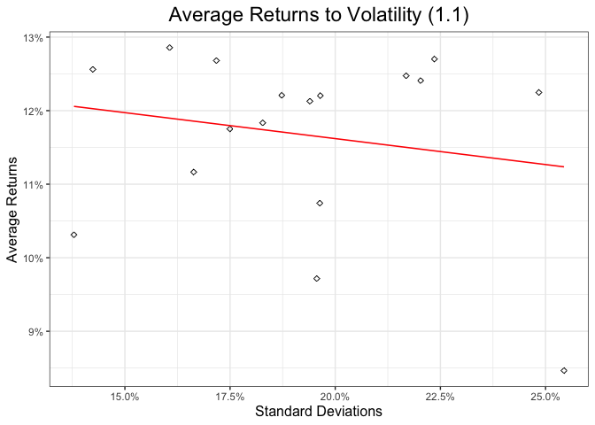
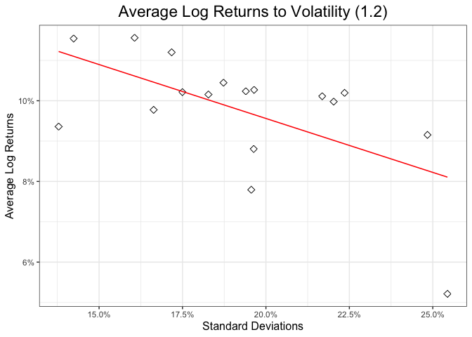
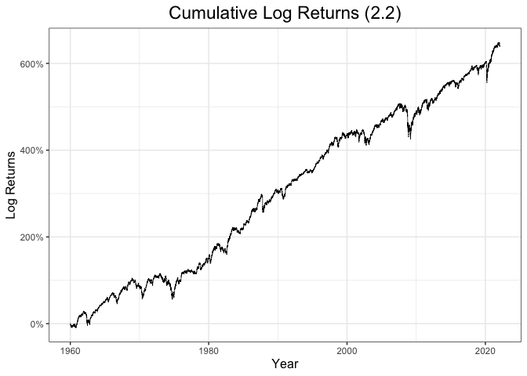
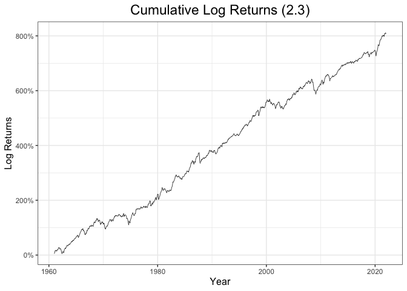
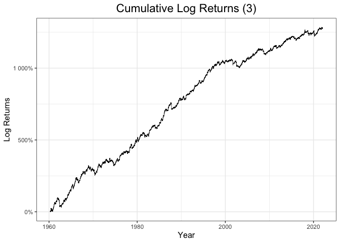
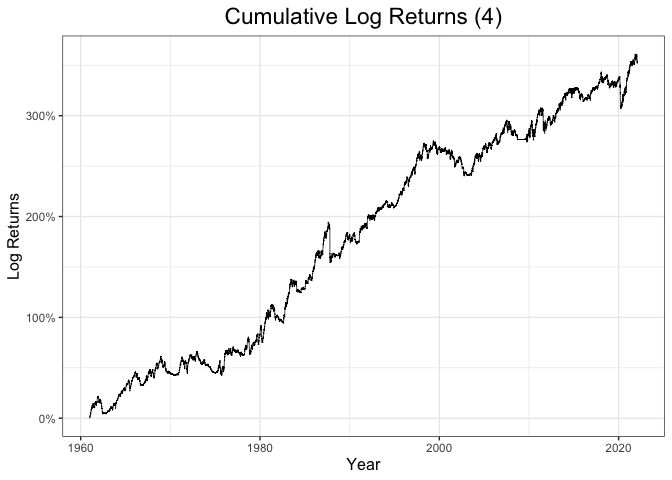
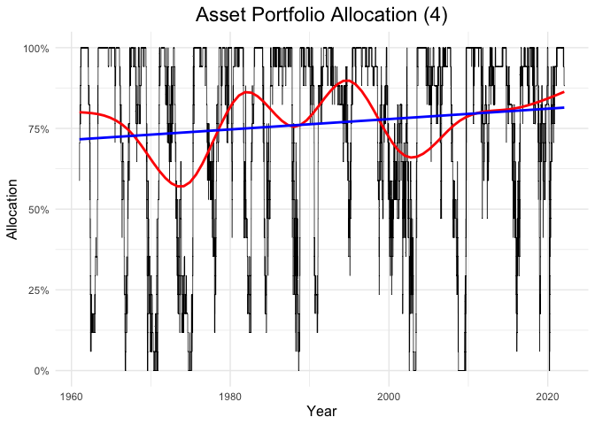
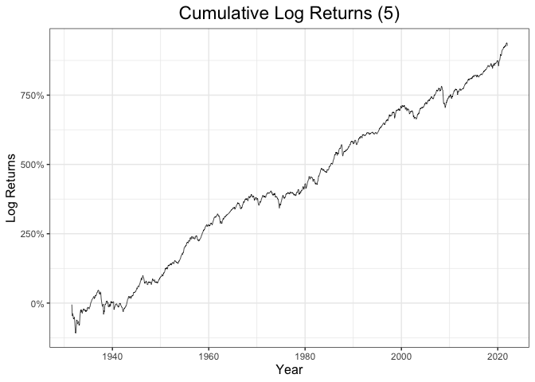

Quantitative Risk and Asset Management
================

- <a href="#outline" id="toc-outline">Outline</a>
- <a href="#question-1" id="toc-question-1">Question 1</a>
- <a href="#question-2" id="toc-question-2">Question 2</a>
  - <a href="#question-2.1" id="toc-question-2.1">Question 2.1</a>
  - <a href="#question-2.2" id="toc-question-2.2">Question 2.2</a>
  - <a href="#question-2.3" id="toc-question-2.3">Question 2.3</a>
- <a href="#question-3" id="toc-question-3">Question 3</a>
- <a href="#question-4" id="toc-question-4">Question 4</a>
- <a href="#question-5" id="toc-question-5">Question 5</a>

## Outline

This is a mandatory assignment for a course *Quantitative Risk and Asset
Management* handed in 2022, transformed into a readable notebook form.

The data used has daily returns for 17 US industries (from the Kenneth
French database, value weighted) from 1926 to 2022.

Testing how github renders functions:

$\frac{\alpha}{2 \lambda}$

<details>
<summary>Code</summary>

``` r
data <- read.csv("/Users/aleksi/BI Quantitative Risk and Asset Management/Industry17PortfoliosDaily.csv", skip = 9, header = T)
head(data)
```

</details>

             X  Food Mines   Oil Clths Durbl Chems Cnsum Cnstr Steel FabPr Machn
    1 19260701  0.03  0.30  0.62  0.14 -1.09  0.56  0.04  0.30 -0.62 -0.79 -0.12
    2 19260702  0.11  0.36  0.71 -0.16 -0.57  1.01  0.60 -0.03  1.18  0.96  0.38
    3 19260706  0.05 -0.19  0.17  0.37 -1.90  0.21  0.47  0.38  0.17  0.68  0.51
    4 19260707  0.54 -0.17 -0.03  0.18 -0.06  0.83 -0.12 -0.10 -0.03  2.36 -0.12
    5 19260708  0.94  0.34  0.09  0.75 -0.28 -0.14  0.42  0.35 -0.07 -0.50  0.48
    6 19260709 -0.41 -0.57 -1.65 -0.09 -1.33 -1.61 -0.45 -0.72 -0.99 -2.08 -0.67
       Cars Trans Utils Rtail Finan Other
    1 -0.15  0.08  0.61 -0.01  0.58 -0.01
    2  1.09  0.05  0.47  0.01 -0.16  0.38
    3  0.88 -0.16  0.73 -0.23  0.20  0.16
    4  0.04  0.12  0.17 -0.58 -0.07  0.42
    5  0.01  0.46 -0.20 -0.36 -0.48  0.49
    6 -1.09 -0.31 -0.74  0.41 -0.03 -0.16

## Question 1

1.1: On average, do more volatile industries have higher average log
returns? And higher average returns?

<details>
<summary>Code</summary>

``` r
# Extracting the data from 1960 to 2022 from the full dataset
data60.22 <- data[data[, 1] > "1960-01-01", ] 

# Computing the log of the 1960-2022 dataset
log.data.60.22 <- data.frame(data60.22$date, log(data60.22[, -1] + 1) )

# Average annualized returns for every industry
avg.ret60.22 <- colMeans(data60.22[, -1] ) * 252 

# Annualized Volatility (standard deviation) for every industry
industry.std60.22 <- apply(data60.22[, -1], 2, sd) * sqrt(252) 

# Defining Log returns for every industry, daily basis
log.ret60.22 <- apply((data60.22[, -1] + 1), 2, log) # + 1 to compute log returns

# Checking for NaNs and infinite values in the log returns:
which(is.infinite(log.ret60.22)) # no infinite values
```

</details>

    integer(0)

<details>
<summary>Code</summary>

``` r
which(is.nan(log.ret60.22))      # no NaNs
```

</details>

    integer(0)

<details>
<summary>Code</summary>

``` r
# Computing annualized average log returns for every industry
avg.log.ret60.22 <- colMeans(log.ret60.22, na.rm = T) * 252

# Checking for non Gaussianity in the data 1960 - 2022
skew <- apply(data60.22[, -1], 2, skewness ) 
kurt <- apply(data60.22[, -1], 2, kurtosis )
mean(kurt) 
```

</details>

    [1] 17.25315

<details>
<summary>Code</summary>

``` r
median(kurt)
```

</details>

    [1] 16.74064

    Warning: Using `size` aesthetic for lines was deprecated in ggplot2 3.4.0.
    ℹ Please use `linewidth` instead.

    `geom_smooth()` using formula = 'y ~ x'





## Question 2

### Question 2.1

Plot the Cumulative log returns for an equal-weighted portfolio (each
industry with weight 1/17). Compute mean, std, and Sharpe ratio for
returns.

<details>
<summary>Code</summary>

``` r
# Computing the portfolio average returns over the 1960-2022 period
bal.port.weights <- rep(1/17,17)                                
bal.port.ret     <- rowSums(bal.port.weights * data60.22[, -1]) 
bal.port.avg.ret <- mean(bal.port.ret) * 252                    

# Portfolio standard deviation
bal.port.std <- sd(bal.port.ret)*sqrt(252)

# Sharpe Ratio
bal.port.Sharpe <- bal.port.avg.ret / bal.port.std

# Computing the cumulative log returns and then plotting 
bal.port.log.ret     <- log(1 + bal.port.ret)    
bal.port.cum.log.ret <- cumsum(bal.port.log.ret) 
```

</details>
<details>
<summary>Code</summary>

``` r
### Plot 4: Cumulative Log returns of the Equally weighted portfolio 
x1 <- data.frame(data60.22$date)
y1 <- data.frame(bal.port.cum.log.ret)
M3 <- cbind(x1, y1)

p3 <- ggplot(M3, aes(x = data60.22$date, y = bal.port.cum.log.ret)) +
  geom_line(size = 0.25) +
  labs(title = "Cumulative Log Returns (2.1)", x = "Year", y ="Log Returns") + 
  theme_bw() +
  theme(axis.title = element_text(size = 12),
        plot.title = element_text(hjust = 0.5)) +
  scale_y_continuous(labels = scales :: percent)

p3 + theme(plot.title = element_text(size = 17))
```

</details>


### Question 2.2

Repeat 2.1, but now weight each industry by the inverse of its
full-sample standard deviation, with weights normalized so they sum up
to one.

<details>
<summary>Code</summary>

``` r
# Computing the full sample industry annualized standard deviation
industry.std.full.sample <- apply(data[, -1], 2, sd) 

# Normalizing the weights to sum up to 1
normalizer        <- (1 / sum(industry.std.full.sample))   # normalizing coefficient
norm.port.weights <- industry.std.full.sample * normalizer # normalized weights
sum(norm.port.weights)                                     # they sum up to 1 
```

</details>

    [1] 1

<details>
<summary>Code</summary>

``` r
mean(norm.port.weights) == 1/17                            # equal to 1/17
```

</details>

    [1] TRUE

<details>
<summary>Code</summary>

``` r
# Annualized average normalized Portfolio returns, 1960-2022 sample data
norm.port.ret     <- rowSums(norm.port.weights * data60.22[, -1])
norm.port.avg.ret <- mean(norm.port.ret) * 252 # norm port returns, annualized

# Normalized portfolio, annualized standard deviation
norm.port.std <- sd(norm.port.ret)*sqrt(252)

# Sharpe Ratio
norm.port.Sharpe <- norm.port.avg.ret / norm.port.std

# Plotting cumulative portfolio log returns 
norm.port.log.ret     <- log(1 + norm.port.ret)   
norm.port.cum.log.ret <- cumsum(norm.port.log.ret) 
```

</details>
<details>
<summary>Code</summary>

``` r
### Plot 5: Cumulative Log returns of the normalized portfolio 
x1 <- data.frame(data60.22$date)
y2 <- data.frame(norm.port.cum.log.ret)
M4 <- cbind(x1, y2)

p4 <- ggplot(M4, aes(x = data60.22$date, y = norm.port.cum.log.ret)) +
  geom_line(size = 0.25) +
  labs(title = "Cumulative Log Returns (2.2)", x = "Year", y ="Log Returns") + 
  theme_bw() +
  theme(axis.title = element_text(size = 12),
        plot.title = element_text(hjust = 0.5)) +
  scale_y_continuous(labels = scales :: percent) +
  theme(axis.text.x = element_text(angle = 0))

p4 + theme(plot.title = element_text(size = 17)) 
```

</details>



### Question 2.3

Repeat (1), but now each month select the 6 industries (each allocated
1/6 of capital) with the highest return in the past 12 months (computed
as $[ P(i;t) / P(i;t-250) ] - 1)$.

<details>
<summary>Code</summary>

``` r
# Generating year.month variable for the 1960-2022 dataset, so that then we can
# select directly both the year and month at the same time
year.mont  <- substring(data60.22$date, 1, 7) 

# New dataframe without the 'day' index in the date variable
data.year.mont60.22 <- data.frame(year.mont = year.mont, 
                                  data60.22[ , -1])

# Aggregating the daily returns in the new dataframe by month to have cumulative 
# log returns for every month
log.data.year.mont60.22 <- data.frame(year.mont = year.mont, 
                                      log(data.year.mont60.22[,-1] +1) )

month.rets <- aggregate(log.data.year.mont60.22[, -1],  
                        by  = list(log.data.year.mont60.22$year.mont), 
                        FUN = sum)
colnames(month.rets)[1] <- "year.mont"

log.month.rets.no.date  <- month.rets[, -1]
```

</details>
<details>
<summary>Code</summary>

``` r
# For loop to get 12 months rolling window for the best 6 asset classes
# Initializing all the variables we need
rm(list)
```

</details>

    Warning in rm(list): object 'list' not found

<details>
<summary>Code</summary>

``` r
industry <- colnames(log.month.rets.no.date) # list of names of every industry
n        <- nrow(month.rets)                 # dimension for the loop, 745 iterations
list     <- NULL                             # initializing the variable that will contain all the 
                                                # names of the best 6 industries

for (i in (13 : n) ) { # starting from 13 since we start building portfolios from 1961/01
  yearly.Rets <- NULL  # initializing the yearly returns
  best.Six    <- NULL  # initialize the best.six vector that will be erased at every iteration
  for (j in industry) {
    yearly.Rets[j] <- colSums( as.matrix(log.month.rets.no.date[ ( (i-12):(i-1) ) , j] )) 
  } 
  best.Six <- names(sort(yearly.Rets, decreasing = TRUE)[1:6]) # best six industries for the previous 12 months
  list     <- rbind(list, best.Six)                            # creating the list with the names of the best industries
}

# Reducing the monthly returns dataset, excluding the first year of data (which
# is lost in the for loop to find the first best six industries)

# Aggregating simple returns to compute avg port rets
month.rets2 <- aggregate(data.year.mont60.22[, -1],  
                        by  = list(data.year.mont60.22$year.mont), 
                        FUN = sum)

new.month.rets <- month.rets2[ (13:n), -1 ] 

# For loop that assigns 1/6 only when the 'industry' is in the 'list', meaning 
# that such industry was one of the best 6 performing in the previous 12 months
# Initializing the weight matrix for the portfolio
w <- data.frame() 

for (i in (1 : nrow(list) ) ) {
  for (j in industry) {
    w[i,j] <- ( (1/6) * (j %in% list[i, ]) )
  }
}

# Computing portfolio returns with the previously defined weights
best.six.port.ret      <- rowSums( w * new.month.rets )
best.six.avg.port.ret  <- mean(best.six.port.ret)*12  # time 12 since those are monthly
                                                      # returns that we want to annualize
# Portfolio standard deviation
best.six.std <- sd(best.six.port.ret)*sqrt(12)

# Portfolio Sharpe Ratio
best.six.sharpe <- best.six.avg.port.ret  / best.six.std 

# Plotting the cumulative log portfolio returns
# Converting months to date variables to plot them on the X axis
month.rets$year.mont   <- as.Date(paste(month.rets$year.mont, '01', sep = '-') )
 
best6.port.log.ret     <- log(1 + best.six.port.ret)  
best6.port.cum.log.ret <- cumsum(best6.port.log.ret ) 
```

</details>
<details>
<summary>Code</summary>

``` r
### Plot 6: Cumulative Log returns for the 12 months momentum strategy portfolio 
y3 <- data.frame(month.rets$year.mont[-(1:12)])
x3 <- data.frame(best6.port.cum.log.ret)
M5 <- cbind(x3, y3)

p5 <- ggplot(M5, aes(x = month.rets$year.mont[-(1:12)], y = best6.port.cum.log.ret)) +
  geom_line(size = 0.25) + 
  labs(title = "Cumulative Log Returns (2.3)", x = "Year", y ="Log Returns") + 
  theme_bw() +
  theme(axis.title = element_text(size = 12),
        plot.title = element_text(hjust = 0.5)) +
  scale_y_continuous(labels = scales :: percent) 

p5 + theme(plot.title = element_text(size = 17)) 
```

</details>



## Question 3

Question 3.3 - Repeat the momentum strategy of Question 2.3, but instead
of a constant, full allocation of capital, in each period (day), compute
the covariance matrix between the 6 chosen industry in the previous 3
months (63 trading days), and use it to target a constant portfolio
standard deviation of 20% annually.

<details>
<summary>Code</summary>

``` r
# First, we need to find the best 6 asset classes in the previous 3 months 
# (63 trading days). We proceed as above, but using daily returns dataset 

rm(list2)
```

</details>

    Warning in rm(list2): object 'list2' not found

<details>
<summary>Code</summary>

``` r
industry2 <- colnames(data60.22[, -1]) # industry variable as before, with no date
n2        <- nrow(data60.22)           # dimension of the for loop
list2     <- NULL

# For loop that computes the daily list of the 6 best performing portfolios in 
# the 3 months before
for (i in (64 : n2) ) { # from 64 since we start from the first day of the 4th month
  daily.Rets <- NULL    # initialize the daily returns
  best.Six   <- NULL
  for (j in industry2) {
    daily.Rets[j] <- colSums(as.matrix(log.data.60.22[ (i-63):(i-1)  , j] )) # USE LOG DATA
  } 
  best.Six <- names(sort(daily.Rets, decreasing = TRUE)[1:6])
  list2    <- rbind(list2, best.Six)
}

# Covariances computed daily among the 6 best asset classes, on the 3 months 
# rolling window of data before
N            <- nrow(list2) 
cov.best.six <- array(rep(NA, 6*6*N), dim = c(6,6,N)) # initialize the 3-dimensional array

for (i in 1:N ) {
  best.six.3.mont <- data.year.mont60.22[ (i:(i+62)), c(list2[i, ])]
  cov.best.six[ , , i] <- cov(best.six.3.mont)
}

# For loop that computes daily portfolio weights starting from an equally
# weighted portfolio, but with weights that are updated every time as defined by
# the formula [ 0.2/sigma_p_annualized ]
weights.star <- NULL 

for (i in (1:N) ) {      
  initial.w <- rep(1/6, 6) # initial weights, equally weighted portfolio of 6 assets      
  port.std.rebal <- sqrt( t(initial.w ) %*% cov.best.six[ , , (i)] %*% initial.w  )
  weights.star[i]  <- (1/6)*( 0.2 / (port.std.rebal*sqrt(252) )) 
}

# Last for loop that computes (as before) the weight matrix for every period. This
# time weights are not constant and are extracted from the previous loop. A weight
# different from zero is assigned only for those days and those industries that
# were in the best 6 performing ones
weights.star.matrix <- data.frame()

for (i in (1 : N ) ) {
  for (j in industry) {
    weights.star.matrix[i,j] <- ( weights.star[i] * (j %in% list2[i, ]) )
  }
}
```

</details>
<details>
<summary>Code</summary>

``` r
# Portfolio returns
data60.22.cut     <- data60.22[-(1:63), -1 ] # removing the first 3 months

port.ret.star     <- rowSums(weights.star.matrix * data60.22.cut)
avg.port.ret.star <- mean(port.ret.star) * 252

# Portfolio standard deviation
port.ret.star.std <- sd(port.ret.star)*sqrt(252) 

# Portfolio Sharpe Ratio
Sharpe.star <- avg.port.ret.star / port.ret.star.std
```

</details>
<details>
<summary>Code</summary>

``` r
# Plotting portfolio cumulative log returns
port.log.ret.star     <- log(port.ret.star + 1)
port.cum.log.ret.star <- cumsum(port.log.ret.star)

### Plot 7: Cumulative Log returns of the 3 months momentum strategy portfolio, 
# with a target volatility of 20% per annum
x4 <- data.frame(data60.22$date[-(1:63)])
y4 <- data.frame(port.cum.log.ret.star)
M6 <- cbind(x4, y4)

p6 <- ggplot(M6, aes(x = data60.22$date[-(1:63)], y = port.cum.log.ret.star)) +
  geom_line(size = 0.25) +
  labs(title = "Cumulative Log Returns (3)", x = "Year", y ="Log Returns") + 
  theme_bw() +
  theme(axis.title = element_text(size = 12),
        plot.title = element_text(hjust = 0.5)) +
  scale_y_continuous(labels = scales :: percent)

p6 + theme(plot.title = element_text(size = 17))
```

</details>



## Question 4

Compute the equal-weighted portfolio as in Question 2.1 (on the
1960-2022 sample) and the yearly return in each industry as in Question
2.3. In each period (each day), compute the share alpha_t of industries
with positive momentum (positive yearly return), and invest in the
equal-weighted portfolio each month a share alpha_t, with the rest going
to cash, which you should assume yields 3% annually

<details>
<summary>Code</summary>

``` r
n.60.22 <- nrow(data60.22) 

# Defining a new empty matrix to be filled in the loop, that will contain all the 
# yearly returns computed on a daily basis
new.yearly.Rets <- matrix(NA, ncol = 17, nrow = (n.60.22- 252 ) )

for (i in (253:n.60.22) ) {
   new.yearly.Rets[(i-252), ] <- colSums( data60.22[  (i-252):(i-1) , -1 ] )
}

# Changing the column names of the matrix with yearly (daily) returns
colnames(new.yearly.Rets) <- industry

# Computing number of industries that have a positive yearly return in every period (day)
positive.yearly.rets  <- (new.yearly.Rets > 0) * 1  # 1s and 0s if the condition is met in every cell

# Column vector containing the number of industries for every period that had a
# previous yearly return > 0
number.pos.industries <- as.matrix(rowSums(positive.yearly.rets))

# Computing the share we invest in the portfolio and the share we invest in the 
# risk free rate for every period 
alpha.portfolio <- number.pos.industries / 17
alpha.rf        <- 1 - alpha.portfolio

# Creating a vector of risk free rate daily returns
rf_rets <- rep( (0.03/252), nrow(alpha.rf) ) 

# Creating an equally weighted portfolio that invests in all assets from 1960 to
# 2022
bal.port.weights     <- rep(1/17,17)
bal.portfolio.rets.4 <- rowSums(bal.port.weights * data60.22[ (253:n.60.22), -1]) 

# Final vector of portfolio returns, with alpha in the assets and (1-alpha) in rf
portfolio_rets_final <- (alpha.portfolio * bal.portfolio.rets.4  + alpha.rf * rf_rets)
excess_rets          <- portfolio_rets_final - (0.03/252) 
mean_excess_rets     <- mean(excess_rets)*252

# Portfolio Standard deviation 
excess_rets_std  <- sd(excess_rets)*sqrt(252)

Sharpe_ratio_final <- mean_excess_rets / excess_rets_std 

# Cheching for correlation among industries
cor(data60.22[, -1]) # They are all positively correlated
```

</details>

                      food     mines       oil   clothes  durables chemicals
    food         1.0000000 0.4221401 0.5635021 0.6372003 0.6668227 0.6818481
    mines        0.4221401 1.0000000 0.6027994 0.4952207 0.5062316 0.6181290
    oil          0.5635021 0.6027994 1.0000000 0.5442680 0.5618443 0.6903127
    clothes      0.6372003 0.4952207 0.5442680 1.0000000 0.7418931 0.7075379
    durables     0.6668227 0.5062316 0.5618443 0.7418931 1.0000000 0.7371643
    chemicals    0.6818481 0.6181290 0.6903127 0.7075379 0.7371643 1.0000000
    consumables  0.7851581 0.4061970 0.5433978 0.6017780 0.6762898 0.6625151
    construction 0.6901560 0.5448562 0.5982225 0.7858976 0.7717992 0.7626440
    steel        0.5423509 0.6874389 0.6536077 0.6596458 0.6644166 0.7670215
    fabricated   0.6526977 0.5799275 0.6269678 0.7443878 0.7470930 0.7807940
    machinery    0.5933947 0.5282759 0.5550709 0.6855738 0.7480683 0.6985862
    cars         0.5876973 0.4788203 0.5273881 0.6699730 0.7123470 0.6906050
    transport    0.6985269 0.5542982 0.6423833 0.7605967 0.7823973 0.8002957
    utilities    0.6671723 0.4621931 0.6120628 0.5619578 0.5592346 0.6185207
    retail       0.7152233 0.4379905 0.5158985 0.7478446 0.7419169 0.6901858
    finance      0.6738145 0.5283206 0.6144143 0.7472040 0.7392522 0.7489268
    others       0.7061397 0.5444107 0.6054952 0.7608868 0.7904640 0.7517579
                 consumables construction     steel fabricated machinery      cars
    food           0.7851581    0.6901560 0.5423509  0.6526977 0.5933947 0.5876973
    mines          0.4061970    0.5448562 0.6874389  0.5799275 0.5282759 0.4788203
    oil            0.5433978    0.5982225 0.6536077  0.6269678 0.5550709 0.5273881
    clothes        0.6017780    0.7858976 0.6596458  0.7443878 0.6855738 0.6699730
    durables       0.6762898    0.7717992 0.6644166  0.7470930 0.7480683 0.7123470
    chemicals      0.6625151    0.7626440 0.7670215  0.7807940 0.6985862 0.6906050
    consumables    1.0000000    0.6653683 0.5208705  0.6286297 0.6258095 0.5712887
    construction   0.6653683    1.0000000 0.6990675  0.7780020 0.7207812 0.7065914
    steel          0.5208705    0.6990675 1.0000000  0.7393210 0.7079244 0.6399191
    fabricated     0.6286297    0.7780020 0.7393210  1.0000000 0.7192180 0.6782067
    machinery      0.6258095    0.7207812 0.7079244  0.7192180 1.0000000 0.6780107
    cars           0.5712887    0.7065914 0.6399191  0.6782067 0.6780107 1.0000000
    transport      0.6858305    0.7993345 0.7326697  0.8056136 0.7503247 0.7203940
    utilities      0.6088031    0.6093170 0.5355988  0.6182085 0.5155898 0.5083854
    retail         0.7167139    0.7950867 0.5920443  0.6912343 0.7061698 0.6765263
    finance        0.6670276    0.7977089 0.6996558  0.7543433 0.7109848 0.6814829
    others         0.7305838    0.8002420 0.7256041  0.7747935 0.8726412 0.7245589
                 transport utilities    retail   finance    others
    food         0.6985269 0.6671723 0.7152233 0.6738145 0.7061397
    mines        0.5542982 0.4621931 0.4379905 0.5283206 0.5444107
    oil          0.6423833 0.6120628 0.5158985 0.6144143 0.6054952
    clothes      0.7605967 0.5619578 0.7478446 0.7472040 0.7608868
    durables     0.7823973 0.5592346 0.7419169 0.7392522 0.7904640
    chemicals    0.8002957 0.6185207 0.6901858 0.7489268 0.7517579
    consumables  0.6858305 0.6088031 0.7167139 0.6670276 0.7305838
    construction 0.7993345 0.6093170 0.7950867 0.7977089 0.8002420
    steel        0.7326697 0.5355988 0.5920443 0.6996558 0.7256041
    fabricated   0.8056136 0.6182085 0.6912343 0.7543433 0.7747935
    machinery    0.7503247 0.5155898 0.7061698 0.7109848 0.8726412
    cars         0.7203940 0.5083854 0.6765263 0.6814829 0.7245589
    transport    1.0000000 0.6205587 0.7419667 0.7895643 0.8075617
    utilities    0.6205587 1.0000000 0.5586017 0.6232721 0.6268410
    retail       0.7419667 0.5586017 1.0000000 0.7223783 0.8001743
    finance      0.7895643 0.6232721 0.7223783 1.0000000 0.8034126
    others       0.8075617 0.6268410 0.8001743 0.8034126 1.0000000

<details>
<summary>Code</summary>

``` r
### Plot 8: Cumulative Log returns for the portfolio with alpha wealth invested
# in an EW portfolio in the industries and (1-alpha) weight in a Risk Free rate
# asset that yields 3% per annum
port.cum.log.exc.ret <- cumsum(log(excess_rets + 1))

x5 <- data.frame(data60.22$date[-(1:252)])
y5 <- data.frame(port.cum.log.exc.ret)
M7 <- cbind(x5, y5)

p7 <- ggplot(M7, aes(x = data60.22$date[-(1:252)], y = port.cum.log.exc.ret)) +
  geom_line(size = 0.25) +
  labs(title = "Cumulative Log Returns (4)", x = "Year", y ="Log Returns") + 
  theme_bw() +
  theme(axis.title = element_text(size = 12),
        plot.title = element_text(hjust = 0.5)) +
  scale_y_continuous(labels = scales :: percent)

p7 + theme(plot.title = element_text(size = 17)) 
```

</details>



<details>
<summary>Code</summary>

``` r
### plot 9: Daily allocation in the EW portfolio of industries

x8 <- data.frame(data60.22$date[-(1:252)])
y8 <- data.frame(alpha.portfolio)
M8 <- cbind(x8, y8)

p10 <- ggplot(M8, aes(x = data60.22$date[-(1:252)], y = alpha.portfolio)) +
  geom_line(size = 0.25) +
  geom_smooth(se = FALSE, color = "red", lwd = 1) +
  geom_smooth(se = FALSE, color = "blue", lwd = 1, method = "lm") +
  labs(title = "Asset Portfolio Allocation (4)", x = "Year", y ="Allocation") + 
  theme_minimal() +
  theme(axis.title = element_text(size = 12),
        plot.title = element_text(hjust = 0.5)) +
  scale_y_continuous(labels = scales :: percent)

p10 + theme(plot.title = element_text(size = 17)) 
```

</details>

    `geom_smooth()` using method = 'gam' and formula = 'y ~ s(x, bs = "cs")'
    `geom_smooth()` using formula = 'y ~ x'



## Question 5

For the full sample, repeat the momentum strategy in Question 2.3, but
use the returns of the previous five years (252 \* 5 days) as a measure
of momentum. Briefly comment on the results.

<details>
<summary>Code</summary>

``` r
# Full log dataset to aggregate
log.data.no.date <- log(data[, -1] + 1) 

year.mont.full   <- substring(data$date, 1, 7) 

# New dataframe without the 'day' index in the date variable
log.data.year.mont.full <- data.frame(year.mont.full = year.mont.full, 
                                      log.data.no.date) 

# Aggregating the daily returns by month 
log.month.rets.full <- aggregate(log.data.year.mont.full[, -1], 
                                 by = list(log.data.year.mont.full$year.mont.full), 
                                 FUN = sum)


# Creating the dataset with monthly simple returns
data.year.mont.full <- data.frame(year.mont.full = year.mont.full, data[, -1] )
month.rets.full     <- aggregate(data.year.mont.full[, -1], 
                                 by = list(data.year.mont.full$year.mont.full), 
                             FUN = sum)


# For loop to get 5 years rolling window for the best 6 asset classes
# Initializing all the variables we need
rm(list3)
```

</details>

    Warning in rm(list3): object 'list3' not found

<details>
<summary>Code</summary>

``` r
industry3        <- colnames(log.month.rets.full[-1]) 
yearly.Rets.full <- NULL                           
n.full           <- nrow(log.month.rets.full)           
list3            <- NULL                            

# 60 MONTHS = 5 YEARS
for (i in (61 : n.full) ) { # starting from 61 since we start building portfolios from 5 years after 1926
  best.Six = NULL           # initialize the best.six vector that will be erased at every iteration
  for (j in industry) {
    yearly.Rets.full[j] <- sum( log.month.rets.full[ ( (i-60):(i-1) ) , j] ) # cumulating monthly rets into 5-years rets
  }
  best.Six <- names( sort(yearly.Rets.full, decreasing = TRUE)[1:6]) # best six industries for the previous 12 months
  list3    <- rbind(list3, best.Six)                            # creating the list with the names of the best industries
}

# Initializing the weight matrix for the portfolio
w.full <- data.frame()

# For loop that assigns 1/6 only when the 'industry' is inside 'list3', meaning 
# that such industry was one of the best 6 performing in the previous 12*5 = 60 months
for (i in (1 : nrow(list3) ) ) {
  for (j in industry) {
    w.full[i,j] <- ( (1/6) * (j %in% list3[i, ]) )
  }
}

# Portfolio returns with the previously defined weights
best.six.port.ret.full      <- rowSums(w.full * month.rets.full[-(1:60), -1])
best.six.avg.port.ret.full  <- mean(best.six.port.ret.full) * 12 

# Portfolio standard deviation
best.six.std.full <- sd(best.six.port.ret.full)*sqrt(12)

# Portfolio Sharpe Ratio
best.six.sharpe.full <- best.six.avg.port.ret.full  / best.six.std.full
```

</details>
<details>
<summary>Code</summary>

``` r
# Plotting cumulative portfolio returns
colnames(month.rets.full)[1] <- "year.mont"
month.rets.full$year.mont    <- as.Date(paste(month.rets.full$year.mont, '01', sep = '-') )

port.log.ret.full     <- log(best.six.port.ret.full  + 1)
port.cum.log.ret.full <- cumsum(port.log.ret.full)

### Plot 8: Cumulative Log Returns for the 5-years momentum strategy portfolio 
x6 <- data.frame(month.rets.full$year.mont[-(1:60)])
y6 <- data.frame(port.cum.log.ret.full)
M8 <- cbind(x6, y6)

p8 <- ggplot(M8, aes(x = month.rets.full$year.mont[-(1:60)], y = port.cum.log.ret.full)) +
  geom_line(size = 0.25) +
  labs(title = "Cumulative Log Returns (5)", x = "Year", y ="Log Returns") + 
  theme_bw() +
  theme(axis.title = element_text(size = 12),
        plot.title = element_text(hjust = 0.5)) +
  scale_y_continuous(labels = scales :: percent)

p8 + theme(plot.title = element_text(size = 17)) 
```

</details>


